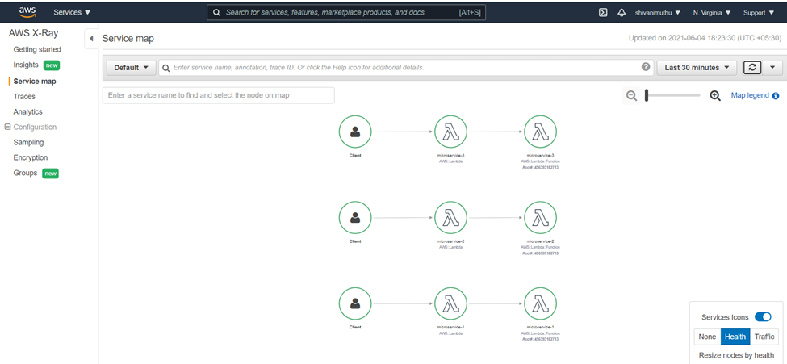

**Using AWS Cloud Watch, AWS X-Ray and Grafana:**

AWS cloudwatch automatically collects metrics data from applications
deployed on AWS and integrates well with a lot of visualisation tools
including Grafana, Prometheus, New Relic, Zipkin etc…

Deployed 3 microservices on AWS:

{width="6.5in" height="3.9993055555555554in"}

<https://h1amwlhj24.execute-api.us-east-1.amazonaws.com/microservice-1>

The above endpoint calls microservice-1(java) which inturn calls
microservice-2(Python) which inturn calls microservice-3(Nodejs)

1.  All the services are deployed on lambda exposed via the API
    Gateway endpoint.

2.  Metrics by default are available on cloud watch

3.  Since CloudWatch integrates with other APM visualisation tools
    easily, this approach has been used

4.  The logging framework/pattern could well be streamlined using AWS
    Xray SDK with the polyglot services

5.  This is just a simple use case to demonstrate integration with
    CloudWatch Logs and other APM monitoring tools, so for simplicity
    AWS Lambda has been used

**Below are some screenshots with metrics:**

{width="6.5in" height="3.0097222222222224in"}

{width="6.5in" height="3.50625in"}

{width="6.5in" height="2.81875in"}

Metrics and logs from cloudwatch streamed ot Grafana:

{width="6.5in" height="3.134027777777778in"}

{width="6.5in" height="3.245138888888889in"}

If an ELK stack or zipkin is used, it would require effort from the
developer side to set up the Zipkin server, Logstash server, Elastic
search server and Kibana. Since AWS provides cloudwatch metrics by
default less effort is required for integration with other services and
tools.

Using cloudwatch would be a more standardised approach as AWS is a
growing Cloud provider, and other tools would definitely provide easy
integration solution with AWS

Before coming up with the approach, I tried the below approach of
setting up zipkin, which internally uses sleuth for distributed tracing.
(Only to later realise that it supports only distributed tracing,
monitoring whether a services is up or not, or Utilization metrics
would require integration with ELK). However it could not provide such a
wide range of metrics that AWS cloudwatch provides. And zipkin would
handle more of distributed tracing and other frameworks would be
required to handle the other scenarios for APM

Zipkin approach – Not recommended

I have deployed 3 Microservices as below

Microservice1 (/microservice1) calls Microservice2 (/microservice2) -
calls Microservice3 (/microservice3)

To get logs on to Zipkin below is the flow involved:

1.  All the 3 microservices use **zipkin** add required headers that
    enable tracing across microservices. Sleuth intercepts the requests
    and adds the required **SpanId, TraceId** and the **timestamp**.

2.  Once Microservice1 receives the response, then the log data is send
    to the zipkin server asynchronously making sure there is no delay in
    the request-response model

3.  An interceptor could be written in zipkin to transfer logs to New
    Relic through the New Relic agent API

{width="6.5in" height="2.397222222222222in"}

Zipkin is available as an sdk aross various languages and can be used as
a monitoring solution. The overhead of using zipkin is the configuration
and maintenance required to stand-up your own zipkins server

{width="6.5in" height="3.4791666666666665in"}
